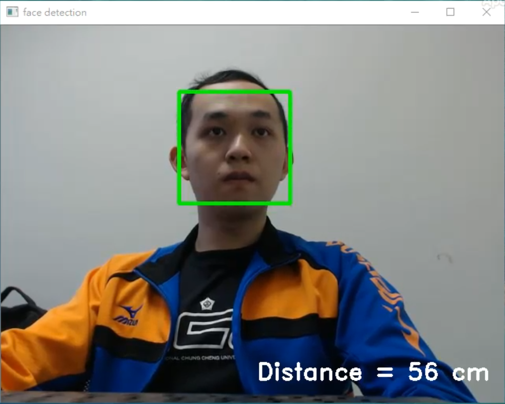
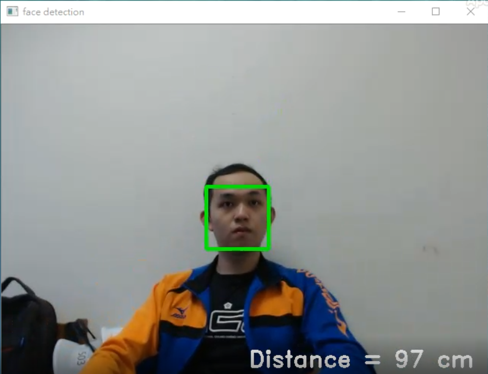

# Object_Distance
detect object and find distance from webcam or pi camera

In this case, I detect face and calculate the distance from webcam or pi camera.

If you want to calculate other object's distance, you need to detect those object
and get the bounding boxes in the image.

## Face_detection
reference: https://github.com/ageitgey/face_recognition

## Dependencies and Environment
You can find these in another repository of mine:
https://github.com/mike98465/Face_Recognition

## My camera
 * Logitech HD Pro Webcam C920
 * pi camera
 
 (For other cameras, you have to modify the focal length in the code)
 
 ## Run 
   (If you want to run on pi camera, you need to run pistream.py on your raspberry pi.)
       
        python object_distance.py
        
## Result:
 
 
